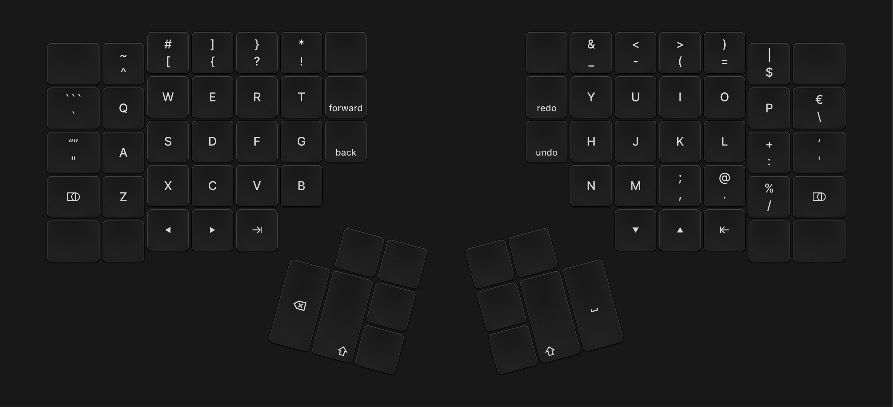

# Alex’s Kinesis Advantage360 ZMK Config

This is my personal [ZMK firmware](https://github.com/zmkfirmware/zmk) configuration. It is based on the
[config repository](https://github.com/KinesisCorporation/Adv360-Pro-ZMK) provided by Kinesis.

## Layout

### Base

## ZMK

By default, this config references a [customized version of ZMK](https://github.com/ReFil/zmk/tree/adv360-z3.5) with
Advantage 360 Pro specific functionality and changes compared to [base ZMK](https://github.com/zmkfirmware/zmk).
The Kinesis fork is regularly updated to incorporate the latest changes from base ZMK. However, it will not always be
completely up to date; some features such as new keycodes may not be immediately available on the 360 Pro after they are
implemented in base ZMK.

While the Advantage 360 Pro is compatible with base ZMK (the PR to merge it can be seen
[here](https://github.com/zmkfirmware/zmk/pull/1454) if you want to see how to implement it), some advanced features
(the indicator RGB LEDs) will not work.
